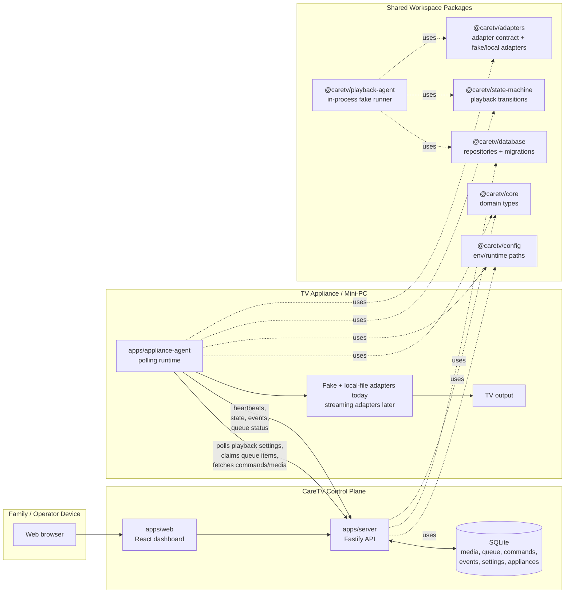

# CareTV

CareTV is a local-first television automation system for a resident who cannot reliably use
a remote. The first milestone is not commercial streaming automation. It is a reliable queue,
state model, dashboard, fake adapter, local-media playback, recovery, and watchdog foundation.

## Current Status

This repository currently contains the Phase 0/1 local prototype:

- pnpm TypeScript workspace
- server control plane
- web dashboard
- appliance agent
- shared package structure
- SQLite repositories for media, queue, commands, events, settings, and appliance heartbeat
- appliance local-media inventory sync and upload download jobs
- fake playback adapter, local-file adapter, Prime Video adapter, YouTube adapter, and state machine
- strict TypeScript, ESLint, Prettier, and Vitest configuration
- Windows-focused startup script

Prime Video and YouTube automation are implemented as early browser adapters. Prime requires a
manually signed-in persistent Chrome profile on the appliance and must be validated on physical
Windows hardware with a real HDMI display because DRM playback can fail in virtualized or
remote-display environments.

## Architecture

CareTV is split into a control plane and an appliance runtime. The control plane owns the dashboard,
API, queue, commands, appliance heartbeat, and SQLite database. The appliance runtime polls the
control plane, claims queued work, runs playback locally, and reports state/events back.



### Runtime Flow

1. The dashboard calls `apps/server` over `/api/v1` to create fake media, manage the queue, start or
   stop playback, toggle loop mode, and issue commands.
2. The server persists media, queue entries, playback commands, appliance heartbeats, and events in
   SQLite through `@caretv/database`.
3. `apps/appliance-agent` polls the server for playback settings. When playback is enabled, it claims
   the next queued entry and fetches the media item.
4. The appliance selects an adapter. Today that is deterministic fake playback, local-file playback,
   Prime Video playback, or YouTube playback in `@caretv/adapters`.
5. The appliance uses `@caretv/state-machine` to turn observations and commands into explicit
   playback states, then reports heartbeats/events/status updates back to the server.
6. The dashboard reads `/api/v1/playback/status` to show queue state, appliance state, and recent
   events.

### Package Responsibilities

- `apps/server`: local Fastify API, CORS handling for the dashboard, SQLite ownership, operator
  endpoints, and appliance polling endpoints.
- `apps/web`: browser dashboard for the fake playback lab.
- `apps/appliance-agent`: polling process intended to run on the TV-connected appliance.
- `apps/agent`: older local placeholder entry point retained while the appliance runtime evolves.
- `apps/watchdog`: placeholder for process health checks and restart behavior.
- `@caretv/core`: shared domain types and health helpers.
- `@caretv/config`: config file and environment loading, validation, path normalization, and redacted config output.
- `@caretv/database`: SQLite migrations and repositories.
- `@caretv/adapters`: playback adapter contract plus deterministic fake, local-file, Prime, and
  YouTube adapters.
- `@caretv/state-machine`: allowed playback transitions and event generation.
- `@caretv/playback-agent`: in-process fake playback runner used by the server-side prototype path.

## Requirements

- Windows 11 for the target development VM
- Node.js LTS
- Corepack enabled for pnpm
- Google Chrome installed for local-file browser playback

## Setup

```powershell
corepack enable
corepack prepare pnpm@9.15.4 --activate
pnpm install
pnpm lint
pnpm typecheck
pnpm test
```

## Development

Start the server, dashboard, and local appliance agent:

```powershell
.\scripts\start-dev.ps1
```

Or run directly:

```powershell
pnpm dev
```

Start only the server-side components on the control-plane machine:

```powershell
.\scripts\start-server.ps1
```

This runs:

- `apps/server` on port `4010`
- `apps/web` on port `4020`

Open the dashboard at `http://w11.lan:4020` from another device on the LAN.

Start only the appliance-side runtime on the TV-connected machine:

```powershell
.\scripts\start-appliance.ps1
```

The appliance finds the server through `serverUrl` in `caretv.config.json`. In
`caretv.config.example.json` it is set to:

```text
serverUrl: "http://w11.lan:4010"
```

## Server And Appliance Deployment

### Server side

Run this on the control-plane machine, VM, or internet host:

```powershell
.\scripts\start-server.ps1
```

Server-side components:

- `apps/server`: API and SQLite owner, default port `4010`
- `apps/web`: dashboard, default port `4020`
- Runtime database and upload staging under `CARETV_RUNTIME_DIR`

If the server is reachable on the LAN as `w11.lan`, use:

```text
{
  "host": "0.0.0.0",
  "serverUrl": "http://w11.lan:4010"
}
```

If the server is on the internet, put it behind a real HTTPS hostname and set the appliance to that
public URL instead:

```text
{
  "serverUrl": "https://caretv.example.com"
}
```

Do not expose the raw development server directly to the internet long-term. The current prototype
has permissive CORS and no production authentication layer.

### Appliance side

The easiest current appliance deployment is a source checkout. This is prototype-grade: it runs the
TypeScript workspace through pnpm instead of a packaged executable or Windows service.

Install prerequisites on the TV-connected Windows appliance:

- Node.js LTS from `https://nodejs.org/`
- Git from `https://git-scm.com/`
- Google Chrome

Corepack ships with Node.js. It provides the pinned pnpm version used by this repo. Open PowerShell
as Administrator once and enable pnpm:

```powershell
node --version
corepack --version
corepack enable
corepack prepare pnpm@9.15.4 --activate
pnpm --version
```

If `corepack enable` fails with `EPERM` under `C:\Program Files\nodejs`, reopen PowerShell as
Administrator and run it again.

If `pnpm --version` fails because `pnpm.ps1` cannot be loaded, allow local user scripts:

```powershell
Set-ExecutionPolicy -Scope CurrentUser -ExecutionPolicy RemoteSigned
pnpm --version
```

If changing the execution policy is not acceptable, use the command shim explicitly:

```powershell
pnpm.cmd --version
pnpm.cmd install
```

Then clone the repo, install dependencies, and create the appliance config:

```powershell
git clone <repo-url> C:\CareTV\app
cd C:\CareTV\app
pnpm install

Copy-Item caretv.config.example.json caretv.config.json
notepad caretv.config.json
```

Set appliance-specific values in `caretv.config.json`:

```json
{
  "serverUrl": "http://w11.lan:4010",
  "applianceId": "living-room-tv",
  "applianceName": "Living Room TV",
  "chromeProfileDir": "C:\\CareTV\\chrome-profile",
  "applianceMediaDir": "C:\\CareTV\\media"
}
```

The appliance start scripts pass the repo-root `caretv.config.json` through `CARETV_CONFIG_FILE`.
This is required because pnpm runs the appliance package with `apps/appliance-agent` as its working
directory. An explicit `CARETV_SERVER_URL` environment variable still overrides the file, but the
scripts do not set that variable when `caretv.config.json` exists.

Start the appliance manually:

```powershell
.\scripts\deployment-start-appliance.ps1
```

After manual startup works, install the logon scheduled task:

```powershell
.\scripts\deployment-install-appliance-logon-task.ps1
```

Appliance-side responsibilities:

- Poll the server for playback settings and queued work
- Poll the server for commands such as pause, resume, skip, and stop
- Send heartbeat, playback state, events, and queue status updates
- Scan `CARETV_APPLIANCE_MEDIA_DIR` and sync discovered local media inventory
- Pull uploaded media from the server and save it locally
- Pull media deletion jobs from the server and delete local files
- Launch Chrome locally for playback

### Network direction and NAT

The appliance is designed to work behind NAT. The server never needs to open a connection into the
appliance.

All appliance communication is appliance-initiated outbound HTTP(S):

- appliance `POST /api/v1/appliance/heartbeat`
- appliance `POST /api/v1/appliance/queue/next`
- appliance `GET /api/v1/appliance/commands`
- appliance `GET /api/v1/appliance/downloads`
- appliance `GET /api/v1/appliance/downloads/:id/file`
- appliance `POST /api/v1/appliance/media-inventory`
- appliance `GET /api/v1/appliance/media-deletions`
- appliance status updates back to the server

The operator dashboard talks to the server directly from the operator's browser. The dashboard does
not talk to the appliance.

Minimum network requirements:

- Appliance: outbound access to `CARETV_SERVER_URL`
- Server: inbound access from appliances and operator browsers
- Appliance: no inbound port forwarding required

Default local endpoints:

- server health: `http://127.0.0.1:4010/health`
- web dashboard: `http://127.0.0.1:4020`

In deployment, the server/dashboard can run on a hosted machine and the appliance agent runs on the
TV appliance. The appliance polls the server for queue work and commands, executes playback locally,
and reports heartbeat/state/events back to the server.

## Fake Playback Lab

The dashboard can add fake media items, enqueue them, start/stop playback, toggle loop, edit queued
items, show discovered local media, upload media for the appliance to download, and show appliance
state/event output.

1. Start the local server, dashboard, and appliance:

   ```powershell
   .\scripts\start-dev.ps1
   ```

2. Open `http://127.0.0.1:4020`.
3. Add one or more fake items.
4. Click `Start`.
5. Watch the output panel, queue statuses, and event log update as items play through.

Fake playback is deterministic. Local-file playback launches Google Chrome with the configured
persistent profile, opens a generated HTML5 player page, loads the appliance-local file, and controls
playback through Chrome DevTools Protocol.

## Streaming URLs

Prime and YouTube items are queued from the dashboard with URLs. The server resolves the page title
from standard page metadata and stores that title on the media item, so the queue and playback UI show
human-readable titles rather than URLs.

The streaming adapters open the URL in visible Chrome through the appliance's persistent
`CARETV_CHROME_PROFILE_DIR`, try to start or resume playback, enter fullscreen, observe the page video
element, and report common blockers such as sign-in, profile selection, purchase/rental requirements,
unavailable titles, age restrictions, and playback errors.

Before testing Prime, start Chrome through the appliance profile and sign into Amazon manually once.
Do not store Amazon credentials in CareTV. Use included-with-Prime titles for validation. YouTube can
play public videos without login, but age-restricted or private videos will be reported as blocked.

Shared adapter components live in `packages/adapters/src`:

- `browserPage.ts`: visible Chrome launch, persistent profile reuse, Chrome DevTools Protocol page
  creation, selector clicks, text-button clicks, and page evaluation.
- `videoObservation.ts`: generic HTML5 video state mapping into CareTV playback observations.
- Service selector modules: Prime and YouTube keep service-specific selectors and blocker detection
  out of the appliance orchestration loop.

## Local Media Inventory And Uploads

The appliance agent scans `CARETV_APPLIANCE_MEDIA_DIR` for `.mp4`, `.m4v`, `.webm`, `.mov`, `.mkv`,
and `.avi` files every `CARETV_APPLIANCE_MEDIA_SCAN_MS`, then syncs those files to the server media
catalog. The dashboard shows those discovered local files under `Discovered media`.

The dashboard upload button sends a media file to the server runtime upload directory. The appliance
polls for pending downloads, saves them into `CARETV_APPLIANCE_MEDIA_DIR`, and reports completion so
the item can be queued from the dashboard.

Queued local media is played by the appliance through the local-file adapter. The adapter reuses the
configured Chrome profile, observes browser video state, and issues player-level play, pause, resume,
stop, and fullscreen commands.

## Appliance Configuration

Runtime config is read from `caretv.config.json` in the working directory by default. Start from
`caretv.config.example.json` and set appliance-specific values there:

```json
{
  "serverUrl": "http://w11.lan:4010",
  "applianceId": "living-room-tv",
  "applianceName": "Living Room TV",
  "chromeProfileDir": "C:\\CareTV\\chrome-profile",
  "applianceMediaDir": "C:\\CareTV\\media"
}
```

The supported file keys match the internal camel-case config names:

- `serverUrl`: server base URL, default `http://127.0.0.1:4010`
- `applianceId`: stable appliance id, default `local-appliance`
- `applianceName`: dashboard display name, default `Local Appliance`
- `appliancePollMs`: control/queue polling interval, default `1000`
- `applianceHeartbeatMs`: idle heartbeat interval, default `5000`
- `appliancePlaybackObserveMs`: playback observation/progress interval, default `1000`
- `applianceMediaDir`: local media folder scanned by the appliance, default `<user data>/CareTV/media`
- `applianceMediaScanMs`: local media scan interval, default `30000`
- `runtimeDir`: runtime database/upload/log location, default `<user data>/CareTV/runtime`
- `chromeProfileDir`: persistent browser profile location, default `<user data>/CareTV/chrome-profile`

Set `CARETV_CONFIG_FILE` only when the config file lives somewhere else. Environment variables still
override file values for deployment overrides.

## Runtime Data

Runtime data must stay outside source control. Use `.env.example` as the starting point and
store browser profiles, SQLite databases, screenshots, and logs under a runtime directory such
as `C:\CareTV\runtime`.

## Next Task

Harden the local-file adapter on physical TV hardware, then add a streaming adapter such as YouTube
before attempting DRM-heavy services.
