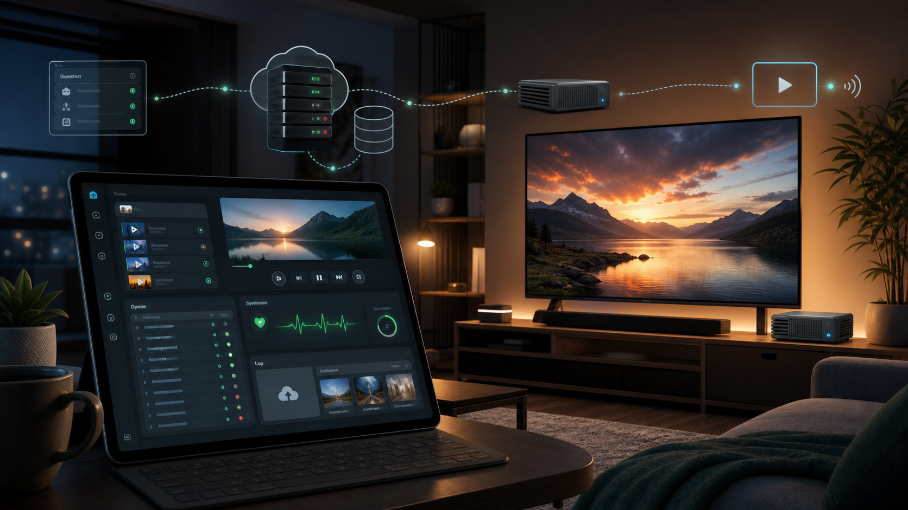

# CareTV Technical README

CareTV is a Windows-focused television automation prototype. A server/dashboard manages media,
playlists, queue state, playback commands, appliance heartbeat, and operational event history. A
TV-connected Windows appliance polls the server, plays items locally, and reports state back.

The current implementation is source-checkout prototype code, not a packaged Windows service.

## What Works

- Fastify API server on port `4010`
- React dashboard on port `4020`
- SQLite runtime database under `runtimeDir`
- appliance polling runtime in `apps/appliance-agent`
- queue, playlist, upload, local-media inventory, downloads, and deletion jobs
- fake playback adapter for deterministic testing
- local-file playback through visible Chrome and Chrome DevTools Protocol
- early YouTube and Prime Video browser adapters
- YouTube fallback playlist support
- manual login commands for YouTube and Prime
- 24-hour dashboard log view derived from stored playback events and dashboard commands
- Windows PowerShell startup scripts and appliance logon scheduled-task installer

## Important Limits

- API endpoints can be protected with `CARETV_AUTH_TOKEN`, but do not expose the raw Node server
  directly. Put HTTPS in front of it with a reverse proxy such as Caddy.
- The server UI does not collect every appliance process log. It shows stored playback events and
  commands. Appliance startup errors, server-connectivity failures, Chrome stderr/stdout, and crashes
  can remain local to the appliance console or scheduled-task history.
- Prime/DRM playback must be validated on physical Windows hardware with a real HDMI display.
  VM or remote-display failures are not proof the adapter is wrong.
- `apps/watchdog` and `apps/agent` are legacy/placeholders. The active appliance runtime is
  `apps/appliance-agent`.
- The app is still run through pnpm/tsx. There is no installer, updater, signed executable, or
  durable Windows service wrapper yet.

## Repo Layout

- `apps/server`: Fastify API, SQLite owner, upload staging, appliance endpoints, dashboard endpoints
- `apps/web`: React/Mantine dashboard
- `apps/appliance-agent`: polling runtime for the TV-connected Windows machine
- `apps/watchdog`: placeholder health-check app
- `apps/agent`: older local placeholder
- `packages/core`: shared domain types
- `packages/config`: config loading, validation, path normalization, directory creation
- `packages/database`: SQLite schema and repositories
- `packages/state-machine`: playback state transitions and event generation
- `packages/adapters`: fake, local-file, YouTube, and Prime playback adapters
- `packages/playback-agent`: in-process playback runner retained for tests/prototype paths
- `scripts`: Windows startup, restart, cleanup, and scheduled-task helpers

## Setup

Prerequisites:

- Windows 11 for the target appliance
- Node.js LTS
- Corepack
- Google Chrome

Install dependencies:

```powershell
corepack enable
corepack prepare pnpm@9.15.4 --activate
pnpm install
```

Run checks:

```powershell
pnpm lint
pnpm typecheck
pnpm test
```

## Local Development

Start server, dashboard, and appliance together:

```powershell
.\scripts\start-dev.ps1
```

Equivalent direct command:

```powershell
pnpm dev
```

Start only the server and dashboard:

```powershell
.\scripts\start-server.ps1
```

Start only the appliance runtime:

```powershell
.\scripts\start-appliance.ps1
```

Default endpoints:

- server health: `http://127.0.0.1:4010/health`
- dashboard: `http://127.0.0.1:4020`

For LAN access, set `host` to `0.0.0.0` in `caretv.config.json` or use
`scripts\deployment-start-full-local-stack.ps1`, which defaults `CARETV_HOST` to `0.0.0.0`.

## Configuration

Runtime config is read from `caretv.config.json` in the working directory unless
`CARETV_CONFIG_FILE` points somewhere else. Environment variables override file values.

Start from:

```powershell
Copy-Item caretv.config.example.json caretv.config.json
```

Then edit `caretv.config.json` if the defaults are not right for the appliance.

Typical appliance config:

```json
{
  "serverUrl": "http://w11.lan:4010",
  "applianceId": "living-room-tv",
  "applianceName": "Living Room TV",
  "chromeProfileDir": "C:\\CareTV\\chrome-profile",
  "applianceMediaDir": "C:\\CareTV\\media"
}
```

Common keys:

- `host`: server bind host, default `127.0.0.1`
- `serverPort`: API port, default `4010`
- `webPort`: dashboard port, default `4020`
- `runtimeDir`: SQLite/upload/runtime data directory
- `chromeProfileDir`: persistent Chrome profile used by adapters
- `serverUrl`: URL the appliance polls
- `authToken`: optional shared API token; required by API clients when configured
- `applianceId`: stable appliance id
- `applianceName`: dashboard display name
- `appliancePollMs`: queue/settings polling interval
- `applianceHeartbeatMs`: idle heartbeat interval
- `appliancePlaybackObserveMs`: playback observation interval
- `applianceRequestTimeoutMs`: appliance HTTP request timeout
- `applianceMediaDir`: local media directory scanned by the appliance
- `applianceMediaScanMs`: local media scan interval
- `notificationWebhookUrl`: optional failure notification endpoint
- `remoteSupportUrl`: optional dashboard link for remote support

## Linux VPS Server Deployment

For an internet-facing server, use the setup script on an Ubuntu/Debian VPS after DNS points at the
VPS and ports `80`/`443` are open:

```bash
sudo bash scripts/setup-linux-vps.sh \
  --domain caretv.example.com \
  --repo https://github.com/you/caretv.git
```

The script installs Node.js 22, Caddy, a `caretv-server` systemd service, builds the web UI, serves
it through Caddy, and writes `/etc/caretv/server.env`. It generates and prints the shared auth token
unless `--token` is supplied. Reruns reuse the existing token by default. It also enables UFW with
default-deny incoming rules, opens SSH/HTTP/HTTPS, and allows full access from `--admin-ip`
(`107.217.177.172` by default).

Set the appliance to the printed values:

```powershell
CARETV_SERVER_URL=https://caretv.example.com
CARETV_AUTH_TOKEN=<printed-token>
```

## Appliance Deployment

Prototype appliance setup:

```powershell
git clone <repo-url> C:\CareTV\app
cd C:\CareTV\app
pnpm install
Copy-Item caretv.config.example.json caretv.config.json
.\scripts\deployment-start-appliance.ps1
```

Useful deployment scripts:

- `scripts\deployment-setup-autostart.ps1`: write config, install reboot/logon autostart, optionally install dependencies, start now, enable playback, and configure Sysinternals Autologon
- `scripts\deployment-install-startup-folder-launcher.ps1`: install a current-user Startup folder launcher; this is the default autostart method and does not require admin
- `scripts\deployment-start-full-local-stack.ps1`: server, dashboard, and appliance on one machine
- `scripts\deployment-restart-full-local-stack.ps1`: clean stale runtime state, then start full stack
- `scripts\deployment-start-appliance.ps1`: appliance only
- `scripts\deployment-restart-appliance.ps1`: restart appliance only
- `scripts\deployment-install-appliance-logon-task.ps1`: install user logon scheduled task; requires suitable Task Scheduler permissions, usually elevated PowerShell
- `scripts\deployment-uninstall-appliance-logon-task.ps1`: remove scheduled task
- `scripts\deployment-uninstall-startup-folder-launcher.ps1`: remove current-user Startup folder launcher
- `scripts\deployment-test-appliance-logon-task.ps1`: trigger the scheduled task manually
- `scripts\deployment-clean-stale-runtime.ps1`: clean stale local runtime state

### Reboot autostart

To make the appliance come back after reboot:

```powershell
.\scripts\deployment-setup-autostart.ps1 `
  -Mode Appliance `
  -StartupMethod StartupFolder `
  -ServerUrl "http://w11.lan:4010" `
  -ApplianceId "living-room-tv" `
  -ApplianceName "Living Room TV" `
  -StartNow
```

For a single machine running server, dashboard, and appliance:

```powershell
.\scripts\deployment-setup-autostart.ps1 -Mode FullStack -StartNow
```

Use `-StartupMethod ScheduledTask` only when running from elevated PowerShell or when Task Scheduler
permissions are already known to work for the current user.
The setup script removes the other autostart method so only one appliance launcher is installed.

To also configure Windows auto-login, download Sysinternals Autologon and pass its executable:

```powershell
.\scripts\deployment-setup-autostart.ps1 `
  -Mode Appliance `
  -ServerUrl "http://w11.lan:4010" `
  -AutologonExe "C:\Tools\Autologon64.exe" `
  -AutologonPassword (Read-Host -AsSecureString "CareTV Windows password")
```

Playback only starts automatically if the server has playback enabled and runnable queue items. The
setup script can ask the server to enable playback immediately with `-EnablePlaybackNow`.

## Runtime Model

The appliance initiates all normal communication:

- heartbeats and playback state
- queue claiming
- media metadata fetches
- command polling
- event posting
- local media inventory sync
- upload downloads
- media deletion completion/failure

The dashboard talks to the server only. It does not open a direct connection to the appliance.

## Logs

The dashboard Logs tab calls `/api/v1/logs` and shows the last 24 hours of:

- appliance playback events posted to `/api/v1/appliance/events`
- dashboard commands stored by the server

It intentionally omits noisy `PLAYING` and `HEARTBEAT` events. It is not a full process-log viewer.
When troubleshooting local appliance failures, also inspect:

- the PowerShell session running `deployment-start-appliance.ps1`
- Windows Task Scheduler history for `CareTV Appliance`
- Chrome behavior on the appliance display
- local stdout/stderr captured by whatever process manager is used

## Media And Playback

Local files:

- appliance scans `applianceMediaDir`
- supported extensions: `.mp4`, `.m4v`, `.webm`, `.mov`, `.mkv`, `.avi`
- dashboard uploads are staged by the server and pulled down by the appliance
- local playback uses Chrome with a generated HTML5 player page

Streaming URLs:

- YouTube and Prime URLs can be queued from the dashboard
- server tries to resolve a human-readable title from page metadata
- adapters open visible Chrome using `chromeProfileDir`
- login/profile/purchase/age/consent blockers are reported as playback failures where detected

Manual login:

- use the dashboard login buttons for YouTube or Prime
- the appliance opens Chrome with the persistent profile
- credentials are not stored by CareTV

## Backlog

- package the appliance as a durable Windows service or scheduled-task wrapper with log files
- add real auth before any internet exposure
- centralize appliance process logs or expose a bounded support bundle
- finish watchdog/restart behavior
- validate local-file playback on the production TV hardware
- harden YouTube and Prime selectors against real-world blocker screens
- add screenshots/diagnostic capture with redaction rules
